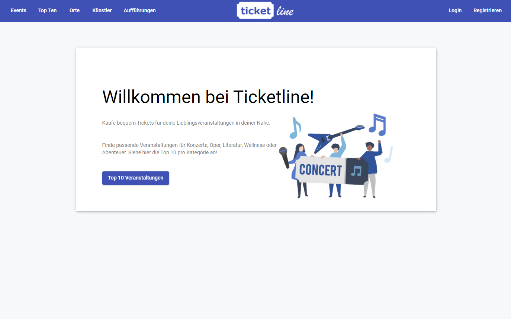
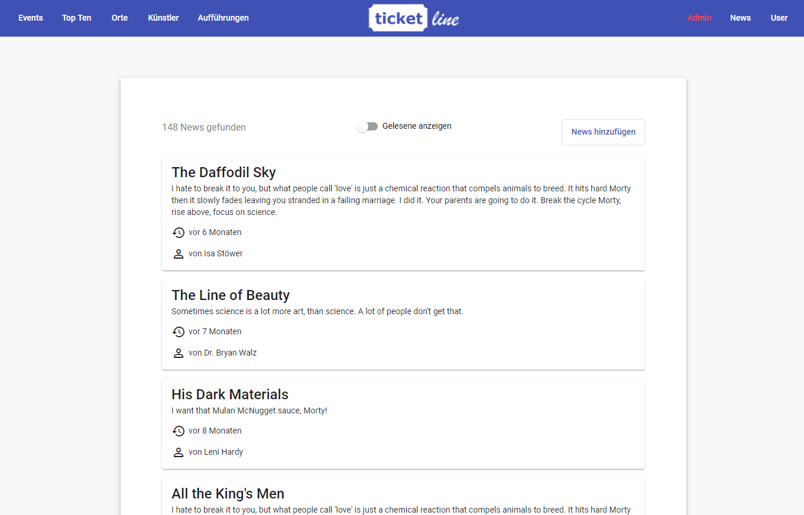
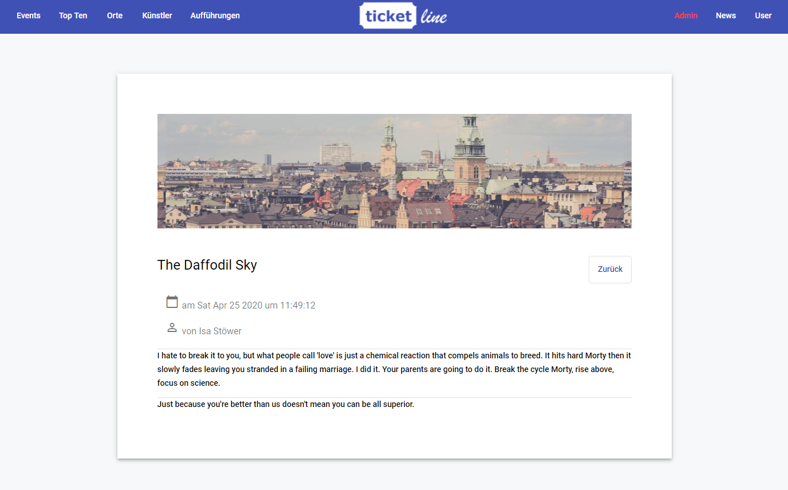
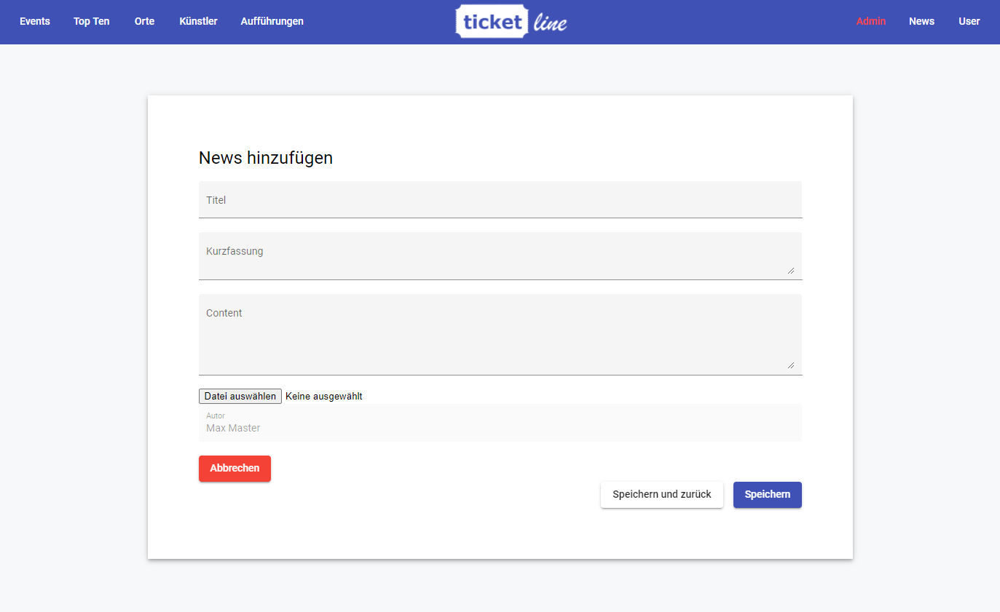

# TicketLine
A big project created by a team of 6, a fully responsive RESTful Web Application, with functions similar to OETicket - reserving, buying tickets and reading news about upcoming events.

  
TicketLine Portal

   

  
News overview page

  

  
News detail page

  

  
News creation (admin) page

  

## Tech Stack

| *Method* | *Implementation* |
|----------:|:----------|
|Programming Language | Java OpenJDK 11.x.x |
|Java-Framework | Spring Boot 2.2.x |
|JavaScript Runtime | Node.js 12.x.x |
|Frontend Framework | Angular 9.x.x |
|Database | H2 1.4.x |
|Test-Framework | JUnit 5.x.x |
|Build & Dependency Management | Maven 3.6.x |
|Versioning | Git 2.x.x |
|Documentation | OpenApi |
|Data generation | Swagger Codegen V3, Mapstruct V1.3 |
|Security & Authentication | Spring Security |

## Contributors

* [Zaishen](https://github.com/Zai-shen)
* amongst 5 other very kind colleagues

### Clarification

This exercise was conducted on a framework produced by the TU Vienna. My part in this project was mostly, but not limited to, everything correlated to the News section.

### Time needed

About 80 hours per teammate were needed to create this REST application.
